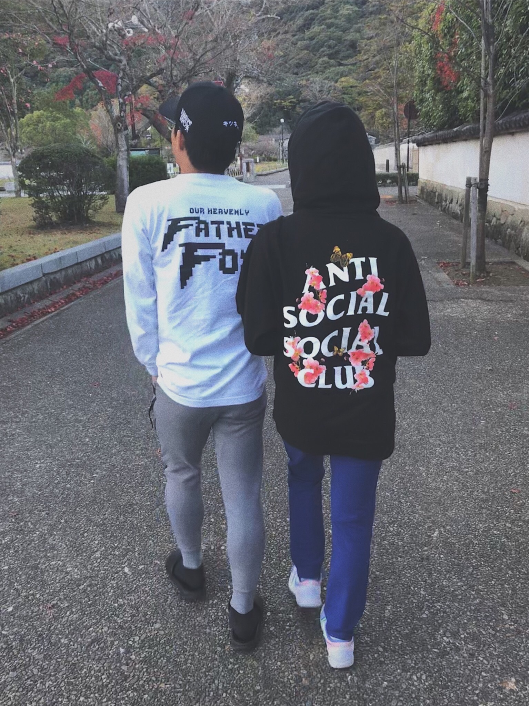

# Jerome Asuncion

Born on the summer of 1997, a year after the GOAT Kobe Bryant was drafted by the Charlotte Hornets, but was traded to the Los Angeles Lakers, where his legendary career would start.

A 3rd year college student currently working on his Bachelor's for Human Resource Management.

Student's current school: [UMUC.](https://www.asia.umuc.edu)

Has traveled to a variety of different places, due to being in a military family. Japan, by far, has been the most favorite place to be stationed at.

Aside from participating in a variety of sports during his high school career, this year marked the first year he started coaching basketball for the local youth sports program.

May well be on the way to coaching other sports, if the schedule permits it.

Photography and editing are some of his other favorite side hobbies, besides sports.

Here is a sample work that was done while on a walk at the Kintai Park: 

*Credit to the models used in the picture: (for privacy purposes, names will not be displayed)*

Any input is greatly appreciated, so here is a link to some of his other finished work: [*Sakura.*](https://vsco.co/jaeosama/images/1)

*To go back to the 1st page: [Home.](https://vnonymous.github.io/index)*
